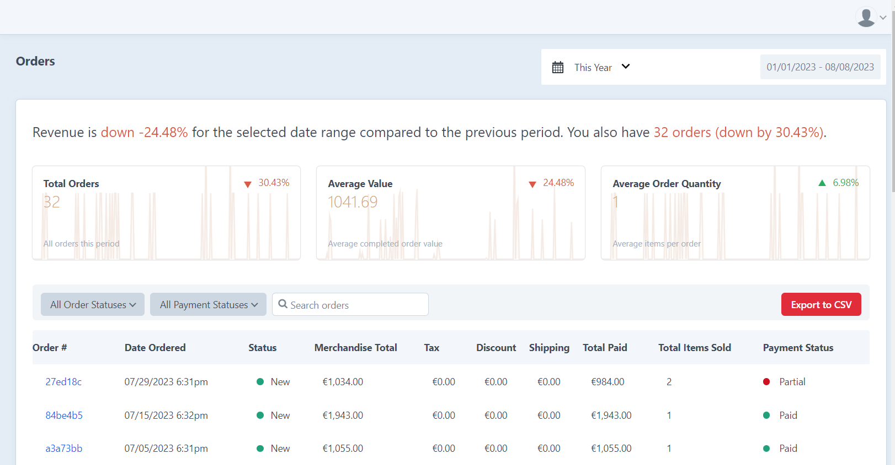
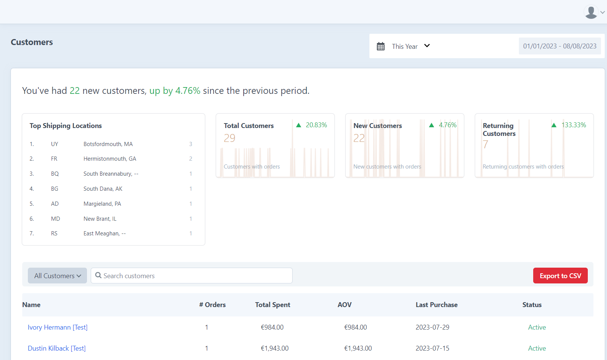
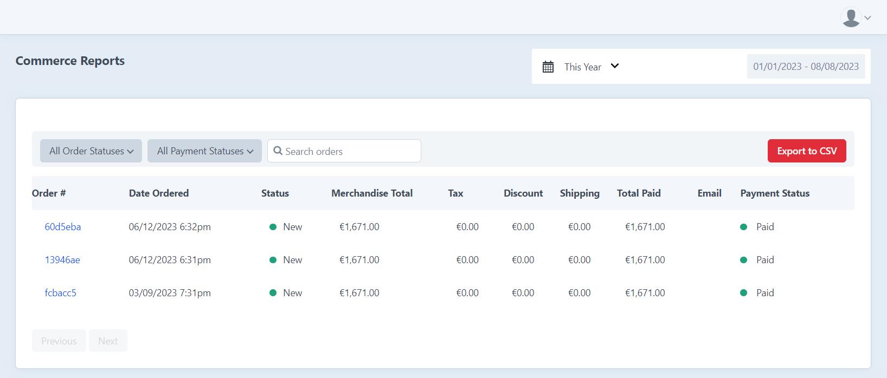

# Commerce Reports

Commerce Reports is a plugin intended to provide better insights and statistics into your sales within Craft Commerce.

## Overview

There are three core pages that provide insights into sales: orders, customers and items sold. From the items sold page, you can navigate to a page that shows.

From each of the pages, you can filter the data in various ways.

### Orders

The "Orders" page gives you an overview of all orders made for a given date range, providing an overview of the average value and unique items in an order, along with the total number of orders.

### Customers

The "Customers" page gives you an overview of the customers that have made orders for a given date range, including a list of the top locations orders are made from.

### Items Sold

The "Items Sold" page gives you an overview of the items sold in orders for a given date range. It supports filtering by a given product type in addition to custom Verbb Events.

### Products

The "Products" page gives you an overview of the orders made for a given product.

## Setup

### Requirements

This plugin requires Craft 4, Craft Commerce 4 and at least PHP 8 to install.

### Installation

This plugin supports installation from the Craft Plugin Store and Composer.

#### Installing via Craft Plugin Store

Go to the Plugin Store in your project’s Control Panel and search for “Commerce Reports”. Then press “Install” or "Try" (if in a testing environment).

#### Installing via Composer

You can add the package to your project using Composer and the command line using the below as a reference.

Open your terminal of choice and go to your Craft project:

`cd /path/to/project`

Tell Composer to require the plugin and then Craft to install it:

`composer require fostercommerce/variant-manager && php craft plugin/install variant-manager`

## Help

### I have an idea for a new feature. Where do I share it?

We're open to new ideas and encourage you to please submit your idea to [GitHub Issues](https://github.com/FosterCommerce/craft-commercereports/issues).

### I found a bug or have a concern. Where do I share it?

Like ideas, please submit the bug/concern to [GitHub Issues](https://github.com/FosterCommerce/craft-commercereports/issues).

We'd ask that you be as detailed as possible and always include the versions of Craft, Craft Commerce and our plugin.

If we don't respond in a reasonable amount of time (72 Hours), please send us an email at support@fostercommerce.com.
